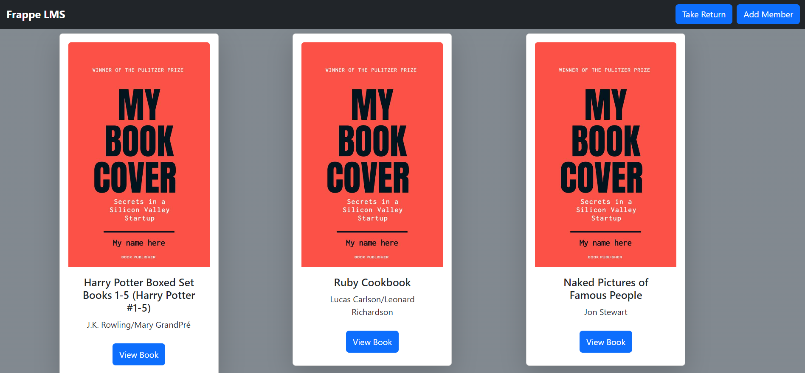
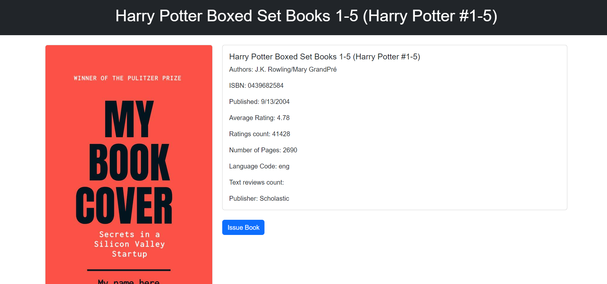
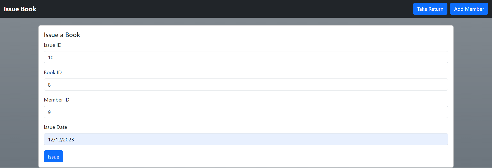
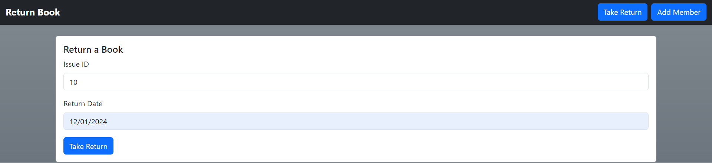
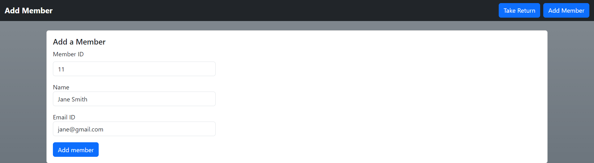

# Library Management System Documentation

This documentation provides an overview of the functionalities and features of the Frappe Library Management System web application. The application allows Librarian to manage books, members, and borrowing activities in a library setting.

## Table of Contents

- [Introduction](#introduction)
- [Functionality](#functionality)
- [Screenshots](#screenshots)
- [Installation](#installation)
- [Usage](#usage)
- [Contributing](#contributing)
- [License](#license)

## Introduction

The Library Management System is a full-stack web application designed to facilitate the management of books and members within a library environment. It aims to simplify the processes of browsing, borrowing, and returning books, as well as managing member information.

## Functionality

1. **Explore All Books**: Users can view a list of all available books in the library. This list includes essential details about each book, such as title, author, and other details.

2. **Import Book from Frappe Library URL**: The application enables Librarian to import book details directly from the Frappe Library URL. This feature streamlines the process of adding new books to the system.

3. **View Each Book**: Users can access detailed information about individual books, including their cover images, descriptions, and other details.

4. **Issue and Return Books**: The system allows issuing books to library members and subsequently process their return. This functionality helps in tracking the borrowing history of books.

5. **Add New Member**: Admin can add new members to the library system. Member details, such as name, email id, and membership ID, can be recorded.

## Screenshots

Below are screenshots showcasing the different pages and functionalities of the Library Management System:

1. Homepage:
    

2. Explore All Books:
   

3. View Each Book:
   

4. Issue and Return Books:
   
   

5. Add New Member:
   

## Installation

To set up the Library Management System locally, follow these steps:

```

1. Clone the repository:
    git clone https://github.com/HS831/frappe-lms.git
    cd frappe-lms

2. Install dependencies for both the frontend and backend:
    pip install -r requirements.txt

3. Create a virtual enviornment using
    pipenv shell

4. Start the application on localhost:5000
    python app.py

```


## Usage

Once the application is set up and running, you can access the different functionalities through your web browser. Use the navigation menu to explore books, view book details, manage members, and process book borrowing and returns.

## License

This project is licensed under the [MIT License](LICENSE).

---
